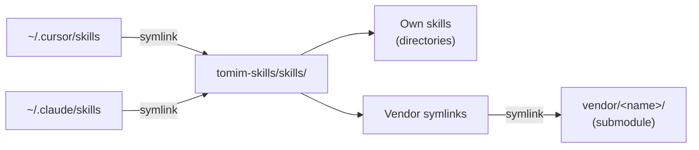

<div align="center">

# 🧠 tomim-skills

### Agent Skills

[](#skills)
[](#install)

</div>

---

Agent skills for **Cursor** and **Claude Code**, kept in one place. Write a workflow once and both editors pick it up. Third-party packs ([Impeccable](https://github.com/pbakaus/impeccable), [improve](https://github.com/shadcn/improve), [Remotion](https://github.com/remotion-dev/skills)) are vendored as git submodules and update with one command.

## Quick start

```bash
# Install everything
curl -fsSL https://raw.githubusercontent.com/tomimor/tomim-skills/main/install.sh | bash -s -- --all

# …or just grab one
curl -fsSL https://raw.githubusercontent.com/tomimor/tomim-skills/main/install.sh | bash -s -- --skill pr-dashboard
```

Then ask your agent to run it: *"give me a PR dashboard for this repo"* or *"miguel review this branch."*

## Why this exists

- **No drift across tools.** Both editors point at this repo's `skills/` directory, so editing once updates both. No copy-pasting.
- **Own and borrowed, together.** Vendor packs are tracked as submodules and refresh with `./install.sh --update-vendor`.
- **One hub.** Author, curate, update, and sync to a new machine from one version-controlled place.

## How it works

Both editors discover skills from a single directory. Own skills live as regular folders under `skills/`. Vendor skills are symlinks pointing into git submodules under `vendor/`.



Every skill, mine or third-party, is discoverable from one `skills/` directory. Any folder (or symlink) in there with a `SKILL.md` is automatically live in both agents.

## Skills

> **Legend** — 🟦 own skill · 🟧 vendor skill (git submodule)

### 🐙 GitHub & Git

| Skill | What it does |
|-------|--------------|
| 🟦 [pr-dashboard](skills/pr-dashboard/SKILL.md) | Status overview of all your open PRs: title, reviews, CI, open comments, and a recommended next step per PR. |
| 🟦 [miguel-review](skills/miguel-review/SKILL.md) | Opinionated diff review biased toward minimal diffs and deletions, with zero tolerance for dead code or premature abstractions. |
| 🟦 [review-pr](skills/review-pr/SKILL.md) | Senior-level review of a teammate's PR: a short list of high-signal comments to paste into GitHub. Drops nitpicks; never auto-posts. |
| 🟦 [verify-pr](skills/verify-pr/SKILL.md) | Three-phase PR verification: code review (via `miguel-review`), test plan with gap analysis, and upstream-assumption validation. |
| 🟦 [gh-pr-comment-assistant](skills/gh-pr-comment-assistant/SKILL.md) | Fetch the latest PR review comments, group and prioritize them, summarize each reviewer's ask, and plan the fixes. |
| 🟦 [gh-pr-description-updater](skills/gh-pr-description-updater/SKILL.md) | Read or rewrite a PR description following the repo's template. Enforces brevity and template compliance. |
| 🟦 [gh-pr-list](skills/gh-pr-list/SKILL.md) | A short, copy-paste Slack message of your open PRs, split into "Ready for review" and "Drafts." |
| 🟦 [gh-issue-creator](skills/gh-issue-creator/SKILL.md) | Create a well-labeled GitHub issue from a bug, feature, or tech-debt template. Fetches labels dynamically. |
| 🟦 [gh-issue-triage](skills/gh-issue-triage/SKILL.md) | Score open, unassigned issues against an AI-readiness rubric and return the top 3 with a ready-to-paste kickoff prompt each. |
| 🟦 [git-worktrees](skills/git-worktrees/SKILL.md) | Give every agent conversation its own branch in its own directory, so parallel chats stop clobbering each other. |
| 🟦 [update-branch](skills/update-branch/SKILL.md) | Pull the latest from main and merge it into the current working branch. |
| 🟦 [save-and-archive](skills/save-and-archive/SKILL.md) | Land a worktree onto main in solo projects: auto-commit, sync, resolve conflicts, fast-forward, push, and remove the worktree. |

### 🔍 Debugging & QA

| Skill | What it does |
|-------|--------------|
| 🟦 [verification-before-completion](skills/verification-before-completion/SKILL.md) | A gate that blocks "done" claims without fresh, executed proof. Adapted from [obra/superpowers](https://github.com/obra/superpowers). |
| 🟦 [qa-manual](skills/qa-manual/SKILL.md) | Drive a web feature through Chrome MCP across the happy path + 2–3 edge cases, capturing screenshots, console errors, and network failures. |
| 🟦 [investigate](skills/investigate/SKILL.md) | Root-cause debugging under the Iron Law: no fix without a confirmed cause. Five phases, 3-strike escalation. Adapted from [gstack](https://github.com/garrytan/gstack). |
| 🟦 [benchmark](skills/benchmark/SKILL.md) | Performance-regression detection for web pages: capture baselines, compare runs, flag regressions. Adapted from [gstack](https://github.com/garrytan/gstack). |
| 🟦 [agent-guide-bootstrap](skills/agent-guide-bootstrap/SKILL.md) | Bootstrap a full `AGENTS.md` + `.agents/` guide system using progressive disclosure. |

### 🎨 Frontend & design

| Skill | What it does |
|-------|--------------|
| 🟦 [ui-review](skills/ui-review/SKILL.md) | Parallel frontend review across typography, layout, accessibility, responsiveness, copy, and polish. Prioritized small fixes, never rewrites. |
| 🟦 [grid-review](skills/grid-review/SKILL.md) | Read-only audit of a page's layout grid: column adherence, baseline rhythm, optical alignment, then a critique. Adapted from [hyperagent-public-skills](https://github.com/alexmcdonnell-airtable/hyperagent-public-skills). |
| 🟧 [impeccable](skills/impeccable/SKILL.md) | Design, critique, polish, and animate frontend interfaces. 20 internal commands (`craft`, `audit`, `animate`, `polish`, …). v3.0.7, from [pbakaus/impeccable](https://github.com/pbakaus/impeccable). |

### 💡 Product, thinking & writing

| Skill | What it does |
|-------|--------------|
| 🟦 [office-hours](skills/office-hours/SKILL.md) | YC-style premise interrogation: six forcing questions, alternative approaches, and a written assignment. Never writes code. Adapted from [gstack](https://github.com/garrytan/gstack). |
| 🟦 [grill-me](skills/grill-me/SKILL.md) | Interview you about a plan, one decision at a time, resolving the decision tree into an assumptions ledger. |
| 🟦 [whats-missing](skills/whats-missing/SKILL.md) | Surface the single most important blindspot in a plan, with an observable signal and a cheap test. |
| 🟦 [writing-voice](skills/writing-voice/SKILL.md) | Write in a direct, personal, sensory style. Bans AI-giveaway phrases, with per-platform guidance (LinkedIn, X, blog, email). |
| 🟦 [governance-message](skills/governance-message/SKILL.md) | Turn a governance proposal URL (forum, Tally, Snapshot) into a Slack-ready summary with stance, risk, and PRO/CON. |
| 🟦 [teach](skills/teach/SKILL.md) | Teach a concept across sessions using the current directory as a stateful workspace. Adapted from [mattpocock/skills](https://github.com/mattpocock/skills). |

### 🧰 Authoring, planning & more

| Skill | What it does |
|-------|--------------|
| 🟦 [create-skill](skills/create-skill/SKILL.md) | Author or audit agent skills: gather requirements, write `SKILL.md`, structure supporting files, verify quality. |
| 🟦 [improve-prompt](skills/improve-prompt/SKILL.md) | Critique and rewrite a prompt using best practices, returning a short critique plus a drop-in rewrite. |
| 🟦 [goal-cursor](skills/goal-cursor/SKILL.md) | A per-workspace goal that keeps Cursor auto-iterating until an evaluator confirms it's met. Cursor's take on Claude Code's `/goal`. |
| 🟦 [meta-ads-bulk-creator](skills/meta-ads-bulk-creator/SKILL.md) | Build Meta Ads Manager bulk-import files from a YAML brief, validated against Meta's enums and limits. |
| 🟧 [improve](skills/improve/SKILL.md) | An advisor, never an implementer: audit a codebase, rank findings by leverage, and write executable plans for a cheaper model to run. v1.0.0, from [shadcn/improve](https://github.com/shadcn/improve). |
| 🟧 [remotion](skills/remotion/SKILL.md) | Best practices for [Remotion](https://github.com/remotion-dev/skills): programmatic video creation in React. |

## Vendor skills

Vendor skills are third-party packs tracked as git submodules under `vendor/` and linked into `skills/` so agents discover them alongside your own.

| Vendor | Source | Version |
|--------|--------|---------|
| Impeccable | [pbakaus/impeccable](https://github.com/pbakaus/impeccable) | v3.0.7 |
| improve | [shadcn/improve](https://github.com/shadcn/improve) | v1.0.0 |
| Remotion | [remotion-dev/skills](https://github.com/remotion-dev/skills) | latest |

**Update all vendors to their latest upstream:**

```bash
./install.sh --update-vendor
```

<details>
<summary><strong>Add a new vendor</strong></summary>

1. Add the submodule:
   ```bash
   git submodule add https://github.com/<owner>/<repo> vendor/<name>
   ```
2. Add an entry to the `VENDOR_SKILLS` array in `install.sh`:
   ```bash
   VENDOR_SKILLS=(
     "impeccable:pbakaus/impeccable:.claude/skills"
     "<name>:<owner>/<repo>:<path-to-skills-dir>"
   )
   ```
3. Create the symlinks:
   ```bash
   for skill_dir in vendor/<name>/<path-to-skills>/*/ ; do
     ln -sf "../vendor/<name>/<path-to-skills>/$(basename "$skill_dir")" "skills/$(basename "$skill_dir")"
   done
   ```

</details>

## Install

```bash
# All skills (non-interactive)
curl -fsSL https://raw.githubusercontent.com/tomimor/tomim-skills/main/install.sh | bash -s -- --all

# A single skill
curl -fsSL https://raw.githubusercontent.com/tomimor/tomim-skills/main/install.sh | bash -s -- --skill pr-dashboard
```

Running `install.sh` with no flags starts an interactive picker.

**Manual install** — copy any skill directory into your platform's skills folder:

```bash
cp -r skills/pr-dashboard ~/.cursor/skills/    # Cursor
cp -r skills/pr-dashboard ~/.claude/skills/     # Claude Code
```

### Flags

| Flag | Description |
|------|-------------|
| `--all` | Install all skills (non-interactive) |
| `--skill <name>` | Install a single skill by name |
| `--target <dir>` | Override the install directory |
| `--force` | Overwrite existing skills without confirming |
| `--update-vendor` | Update vendor submodules to their latest versions |

## Platform compatibility

Skills use the same `SKILL.md` format everywhere. The only difference is where they live on disk:

| Platform | Install path |
|----------|--------------|
| Cursor | `~/.cursor/skills/<skill-name>/` |
| Claude Code | `~/.claude/skills/<skill-name>/` |

Most GitHub-related skills need the [GitHub CLI](https://cli.github.com/) (`gh`). `writing-voice`, `teach`, `remotion`, and the Impeccable design skills have no extra requirements.

## License

[MIT](LICENSE) · built by [@tomimor](https://github.com/tomimor)
