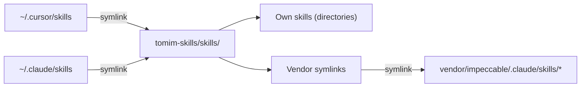

# tomim-skills

Agent skills I use daily across Cursor and Claude Code. Each skill teaches an AI coding agent how to perform a specific workflow -- reviewing PRs, managing GitHub issues, writing in my voice, and more.

This repo also manages **vendor skills** (third-party skill sets like [Impeccable](https://github.com/pbakaus/impeccable)) via git submodules, so everything stays in one place and updates with a single command.

## Architecture

This repo is the single source of truth for all agent skills. Both Cursor and Claude Code point here through symlinks:



- **Own skills** live directly in `skills/` as regular directories (e.g. `skills/miguel-review/`)
- **Vendor skills** are symlinks in `skills/` that point into `vendor/<name>/` submodules (e.g. `skills/polish` -> `../vendor/impeccable/.claude/skills/polish`)
- The `vendor/` directory contains git submodules pinned to specific commits, each referencing the original upstream repo

This means every agent skill -- whether mine or third-party -- is discoverable from a single `skills/` directory.

## Skills

### GitHub Workflow

| Skill | Description |
|-------|-------------|
| [pr-dashboard](skills/pr-dashboard/SKILL.md) | Generate a status overview of your open PRs for any repo. Shows title, reviews, CI, comments, and a recommended next step per PR. |
| [miguel-review](skills/miguel-review/SKILL.md) | Opinionated code review biased toward minimal diffs, deletions over additions, and zero tolerance for dead code or premature abstractions. |
| [gh-pr-comment-assistant](skills/gh-pr-comment-assistant/SKILL.md) | Fetch PR review comments, group and prioritize them, summarize what each reviewer is asking, and help plan fixes. |
| [gh-issue-creator](skills/gh-issue-creator/SKILL.md) | Create well-labeled GitHub issues using bug, feature, or tech debt templates. Fetches labels dynamically and enforces concise descriptions. |
| [gh-pr-description-updater](skills/gh-pr-description-updater/SKILL.md) | Read or update a PR description following the repo's PR template. Enforces brevity and template compliance. |
| [verify-pr](skills/verify-pr/SKILL.md) | Three-phase PR verification: code review (via miguel-review), test plan with gap analysis, and upstream assumption validation. |
| [ui-review](skills/ui-review/SKILL.md) | Comprehensive frontend UI review across typography, layout, accessibility, responsiveness, copy, visual polish, and design critique. |

### Writing

| Skill | Description |
|-------|-------------|
| [writing-voice](skills/writing-voice/SKILL.md) | Write in a direct, personal, sensory style. Bans AI-giveaway phrases, enforces visual formatting, and includes platform-specific guidance for LinkedIn, X, blog, email, and technical writing. |

### Design -- [Impeccable](https://github.com/pbakaus/impeccable) v2.1.1

Vendor skills from Paul Bakaus's Impeccable, managed via git submodule.

| Skill | Description |
|-------|-------------|
| [impeccable](skills/impeccable/SKILL.md) | Create distinctive, production-grade frontend interfaces with high design quality. Supports `craft`, `teach`, and `extract` modes. |
| [shape](skills/shape/SKILL.md) | Plan UX and UI for a feature before writing code. Runs a discovery interview and produces a design brief. |
| [polish](skills/polish/SKILL.md) | Final quality pass fixing alignment, spacing, consistency, and micro-details before shipping. |
| [distill](skills/distill/SKILL.md) | Strip designs to their essence by removing unnecessary complexity. |
| [audit](skills/audit/SKILL.md) | Technical quality checks across accessibility, performance, theming, and responsive design with scored reports. |
| [critique](skills/critique/SKILL.md) | Evaluate design from a UX perspective with quantitative scoring, persona testing, and anti-pattern detection. |
| [adapt](skills/adapt/SKILL.md) | Adapt designs for different screen sizes, devices, and platforms with fluid layouts and breakpoints. |
| [animate](skills/animate/SKILL.md) | Enhance features with purposeful animations, micro-interactions, and motion effects. |
| [bolder](skills/bolder/SKILL.md) | Amplify safe or boring designs to be more visually interesting while maintaining usability. |
| [quieter](skills/quieter/SKILL.md) | Tone down overly aggressive designs, reducing intensity while preserving quality. |
| [clarify](skills/clarify/SKILL.md) | Improve unclear UX copy, error messages, microcopy, and labels. |
| [colorize](skills/colorize/SKILL.md) | Add strategic color to monochromatic interfaces for more visual engagement. |
| [delight](skills/delight/SKILL.md) | Add moments of joy, personality, and unexpected touches that make interfaces memorable. |
| [harden](skills/harden/SKILL.md) | Make interfaces production-ready: error handling, empty states, i18n, and edge cases. |
| [layout](skills/layout/SKILL.md) | Improve layout, spacing, and visual rhythm. Fix monotonous grids and weak hierarchy. |
| [optimize](skills/optimize/SKILL.md) | Diagnose and fix UI performance across loading, rendering, animations, and bundle size. |
| [overdrive](skills/overdrive/SKILL.md) | Push interfaces past conventional limits with shaders, spring physics, and scroll-driven reveals. |
| [typeset](skills/typeset/SKILL.md) | Improve typography: font choices, hierarchy, sizing, weight, and readability. |

## Vendor Skills

Vendor skills are third-party skill sets managed as git submodules under `vendor/`. They're linked into `skills/` via symlinks so agents discover them alongside your own skills.

### Adding a new vendor

1. Add the submodule:
   ```bash
   git submodule add https://github.com/<owner>/<repo> vendor/<name>
   ```

2. Add an entry to the `VENDOR_SKILLS` array in `install.sh`:
   ```bash
   VENDOR_SKILLS=(
     "impeccable:pbakaus/impeccable:.claude/skills"
     "<name>:<owner>/<repo>:<path-to-skills-dir>"
   )
   ```

3. Create symlinks:
   ```bash
   for skill_dir in vendor/<name>/<path-to-skills>/*/ ; do
     ln -sf "../vendor/<name>/<path-to-skills>/$(basename "$skill_dir")" "skills/$(basename "$skill_dir")"
   done
   ```

### Updating vendors to latest

```bash
./install.sh --update-vendor
```

This pulls the latest commits from each vendor's upstream repo and re-links their skills.

## Install

### Quick install (all skills)

```bash
curl -fsSL https://raw.githubusercontent.com/tomimor/tomim-skills/main/install.sh | bash -s -- --all
```

### Install a single skill

```bash
curl -fsSL https://raw.githubusercontent.com/tomimor/tomim-skills/main/install.sh | bash -s -- --skill pr-dashboard
```

### Manual install

Copy any skill directory into your platform's skills folder:

```bash
# Cursor
cp -r skills/pr-dashboard ~/.cursor/skills/

# Claude Code
cp -r skills/pr-dashboard ~/.claude/skills/
```

### Install script options

| Flag | Description |
|------|-------------|
| `--all` | Install all skills (non-interactive) |
| `--skill <name>` | Install a single skill by name |
| `--target <dir>` | Override the install directory |
| `--force` | Overwrite existing skills without confirming |
| `--update-vendor` | Update vendor submodules to their latest versions |

Running without flags starts an interactive picker.

## Platform Compatibility

Skills use the same SKILL.md format across platforms. The only difference is where they live on disk:

| Platform | Install path |
|----------|-------------|
| Cursor | `~/.cursor/skills/<skill-name>/` |
| Claude Code | `~/.claude/skills/<skill-name>/` |

All skills in this repo require the [GitHub CLI](https://cli.github.com/) (`gh`) except `writing-voice` and the Impeccable design skills.

## License

[MIT](LICENSE)
