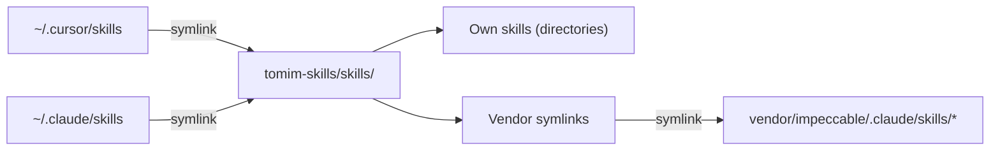

# tomim-skills

Agent skills I use daily across Cursor and Claude Code. Each skill teaches an AI coding agent how to perform a specific workflow -- reviewing PRs, managing GitHub issues, writing in my voice, and more.

This repo also manages **vendor skills** (third-party skill sets like [Impeccable](https://github.com/pbakaus/impeccable)) via git submodules, so everything stays in one place and updates with a single command.

## Architecture

This repo is the single source of truth for all agent skills. Both Cursor and Claude Code point here through symlinks:



- **Own skills** live directly in `skills/` as regular directories (e.g. `skills/miguel-review/`)
- **Vendor skills** are symlinks in `skills/` that point into `vendor/<name>/` submodules (e.g. `skills/impeccable` -> `../vendor/impeccable/.claude/skills/impeccable`)
- The `vendor/` directory contains git submodules pinned to specific commits, each referencing the original upstream repo

This means every agent skill -- whether mine or third-party -- is discoverable from a single `skills/` directory.

## Skills

### GitHub Workflow

| Skill | Description |
|-------|-------------|
| [pr-dashboard](skills/pr-dashboard/SKILL.md) | Generate a status overview of your open PRs for any repo. Shows title, reviews, CI, comments, and a recommended next step per PR. |
| [miguel-review](skills/miguel-review/SKILL.md) | Opinionated code review biased toward minimal diffs, deletions over additions, and zero tolerance for dead code or premature abstractions. |
| [gh-pr-comment-assistant](skills/gh-pr-comment-assistant/SKILL.md) | Fetch PR review comments, group and prioritize them, summarize what each reviewer is asking, and help plan fixes. |
| [gh-issue-creator](skills/gh-issue-creator/SKILL.md) | Create well-labeled GitHub issues using bug, feature, or tech debt templates. Fetches labels dynamically and enforces concise descriptions. |
| [gh-pr-description-updater](skills/gh-pr-description-updater/SKILL.md) | Read or update a PR description following the repo's PR template. Enforces brevity and template compliance. |
| [verify-pr](skills/verify-pr/SKILL.md) | Three-phase PR verification: code review (via miguel-review), test plan with gap analysis, and upstream assumption validation. |
| [ui-review](skills/ui-review/SKILL.md) | Comprehensive frontend UI review across typography, layout, accessibility, responsiveness, copy, visual polish, and design critique. |

### Git Workflow

| Skill | Description |
|-------|-------------|
| [save-and-archive](skills/save-and-archive/SKILL.md) | Land a worktree conversation onto main in solo projects: auto-commit pending work, sync with origin/main resolving conflicts inside the worktree, fast-forward main, push, and remove the worktree. Counterpart to `git-worktrees`. |

### Verification & QA

| Skill | Description |
|-------|-------------|
| [verification-before-completion](skills/verification-before-completion/SKILL.md) | Gate that blocks "done" claims without fresh, executed proof. Forces running a proof command and reading its output before claiming success. Adapted from [obra/superpowers](https://github.com/obra/superpowers). |
| [qa-manual](skills/qa-manual/SKILL.md) | Drive a web feature in Chrome MCP through happy path + 2-3 edge cases, capturing screenshots, console errors, and network failures. Produces the evidence that `verification-before-completion` gates on. |

### Engineering & Debug

| Skill | Description |
|-------|-------------|
| [investigate](skills/investigate/SKILL.md) | Systematic root-cause debugging with the Iron Law -- no fix without a confirmed root cause. Five phases: collect, pattern-match, hypothesize, fix, verify. 3-strike rule escalates to the user. Adapted from [gstack](https://github.com/garrytan/gstack). |
| [benchmark](skills/benchmark/SKILL.md) | Performance regression detection for web pages. Captures baselines (page load, Core Web Vitals, bundles), compares subsequent runs, and flags regressions by configurable thresholds. Uses Chrome MCP, Lighthouse, or Playwright. Adapted from [gstack](https://github.com/garrytan/gstack). |

### Product & Brainstorming

| Skill | Description |
|-------|-------------|
| [office-hours](skills/office-hours/SKILL.md) | YC-style premise interrogation. Six forcing questions in startup mode, generative questions in builder mode, 2-3 alternative approaches, and a mandatory written assignment. Never writes code. Adapted from [gstack](https://github.com/garrytan/gstack). |
| [grill-me](skills/grill-me/SKILL.md) | Interview the user relentlessly about a plan or design, one decision at a time, via `AskQuestion`. Resolves the decision tree in dependency order and produces an assumptions ledger. |

### Writing

| Skill | Description |
|-------|-------------|
| [writing-voice](skills/writing-voice/SKILL.md) | Write in a direct, personal, sensory style. Bans AI-giveaway phrases, enforces visual formatting, and includes platform-specific guidance for LinkedIn, X, blog, email, and technical writing. |

### Learning

| Skill | Description |
|-------|-------------|
| [teach](skills/teach/SKILL.md) | Teach a new skill or concept across multiple sessions, using the current directory as a stateful teaching workspace -- mission grounding, curated high-trust resources, learning records, an opinionated glossary, and beautiful self-contained HTML lessons built around tight feedback loops. Adapted from [mattpocock/skills](https://github.com/mattpocock/skills). |

### Governance & Voting

| Skill | Description |
|-------|-------------|
| [governance-message](skills/governance-message/SKILL.md) | Turn a governance proposal URL (forum, Tally, Snapshot) into a Slack-ready summary. Fetches the page, extracts proposer + context + risks, and drafts the message using a fixed template with voting stance, risk level, PRO/CON, and on-chain vote rationale. |

### Design -- [Impeccable](https://github.com/pbakaus/impeccable) v3.0.7

Vendor skill from Paul Bakaus's Impeccable, managed via git submodule. Since v3.0, all design commands are consolidated into a single skill with 20 internal commands.

| Skill | Description |
|-------|-------------|
| [impeccable](skills/impeccable/SKILL.md) | Design, redesign, shape, critique, audit, polish, and improve frontend interfaces. Commands: `craft`, `shape`, `audit`, `critique`, `animate`, `bolder`, `colorize`, `delight`, `layout`, `overdrive`, `quieter`, `typeset`, `adapt`, `clarify`, `distill`, `harden`, `onboard`, `optimize`, `polish`, `teach`, `document`, `extract`, `live`. |

### Planning & Delegation -- [improve](https://github.com/shadcn/improve) v1.0.0

Vendor skill from shadcn, managed via git submodule. An advisor (never an implementer): it audits a codebase, vets the findings, and writes self-contained plans that a cheaper model can execute and that it then reviews. The plan is the product.

| Skill | Description |
|-------|-------------|
| [improve](skills/improve/SKILL.md) | Audit any codebase across nine categories (correctness, security, perf, tests, tech debt, deps, DX, docs, direction), rank findings by leverage, and write executable plans into `plans/`. Never edits source itself. Variants: `quick`, `deep`, `<category>`, `branch`, `next`, `plan <desc>`, `review-plan`, `execute`, `reconcile`, `--issues`. |

## Vendor Skills

Vendor skills are third-party skill sets managed as git submodules under `vendor/`. They're linked into `skills/` via symlinks so agents discover them alongside your own skills.

### Adding a new vendor

1. Add the submodule:
   ```bash
   git submodule add https://github.com/<owner>/<repo> vendor/<name>
   ```

2. Add an entry to the `VENDOR_SKILLS` array in `install.sh`:
   ```bash
   VENDOR_SKILLS=(
     "impeccable:pbakaus/impeccable:.claude/skills"
     "<name>:<owner>/<repo>:<path-to-skills-dir>"
   )
   ```

3. Create symlinks:
   ```bash
   for skill_dir in vendor/<name>/<path-to-skills>/*/ ; do
     ln -sf "../vendor/<name>/<path-to-skills>/$(basename "$skill_dir")" "skills/$(basename "$skill_dir")"
   done
   ```

### Updating vendors to latest

```bash
./install.sh --update-vendor
```

This pulls the latest commits from each vendor's upstream repo and re-links their skills.

## Install

### Quick install (all skills)

```bash
curl -fsSL https://raw.githubusercontent.com/tomimor/tomim-skills/main/install.sh | bash -s -- --all
```

### Install a single skill

```bash
curl -fsSL https://raw.githubusercontent.com/tomimor/tomim-skills/main/install.sh | bash -s -- --skill pr-dashboard
```

### Manual install

Copy any skill directory into your platform's skills folder:

```bash
# Cursor
cp -r skills/pr-dashboard ~/.cursor/skills/

# Claude Code
cp -r skills/pr-dashboard ~/.claude/skills/
```

### Install script options

| Flag | Description |
|------|-------------|
| `--all` | Install all skills (non-interactive) |
| `--skill <name>` | Install a single skill by name |
| `--target <dir>` | Override the install directory |
| `--force` | Overwrite existing skills without confirming |
| `--update-vendor` | Update vendor submodules to their latest versions |

Running without flags starts an interactive picker.

## Platform Compatibility

Skills use the same SKILL.md format across platforms. The only difference is where they live on disk:

| Platform | Install path |
|----------|-------------|
| Cursor | `~/.cursor/skills/<skill-name>/` |
| Claude Code | `~/.claude/skills/<skill-name>/` |

All skills in this repo require the [GitHub CLI](https://cli.github.com/) (`gh`) except `writing-voice`, `teach`, and the Impeccable design skills.

## License

[MIT](LICENSE)
